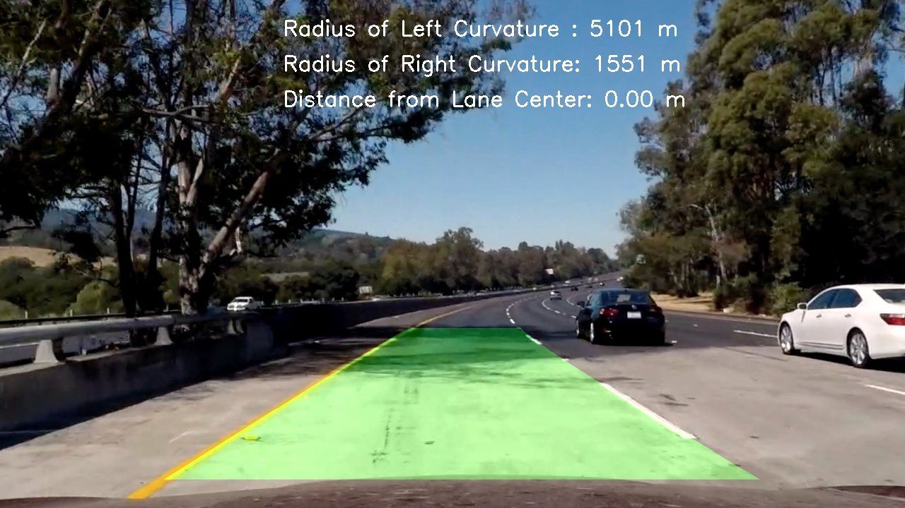

# Advanced Lane Detection

In this project, my goal is to write a software pipeline to identify the lane boundaries in images and videos using advanced computer vision techniques.

The goals / steps of this project can be summarized as follows: 

* Compute the camera calibration matrix and distortion coefficients given a set of chessboard images.
* Apply a distortion correction to raw images.
* Use color transforms, gradients, etc., to create a thresholded binary image.
* Apply a perspective transform to rectify binary image ("birds-eye view").
* Detect lane pixels and fit to find the lane boundary.
* Determine the curvature of the lane and vehicle position with respect to center.
* Warp the detected lane boundaries back onto the original image.
* Output visual display of the lane boundaries and numerical estimation of lane curvature and vehicle position.

For more details please check out the [the full report](https://github.com/wafarag/Advanced-Lane-Detection/blob/master/P4%20Advanced%20Lane%20Detection%20Project%20Report%20ver%201.0.pdf) or the [update](https://github.com/wafarag/Advanced-Lane-Detection/blob/master/Update%20P3%20Report.pdf)
Also, you can check the [source code] (https://github.com/wafarag/Advanced-Lane-Detection/blob/master/P4%20AdvLane3.py) and [the output video] (https://github.com/wafarag/Advanced-Lane-Detection/blob/master/project_video_output_new.mp4).